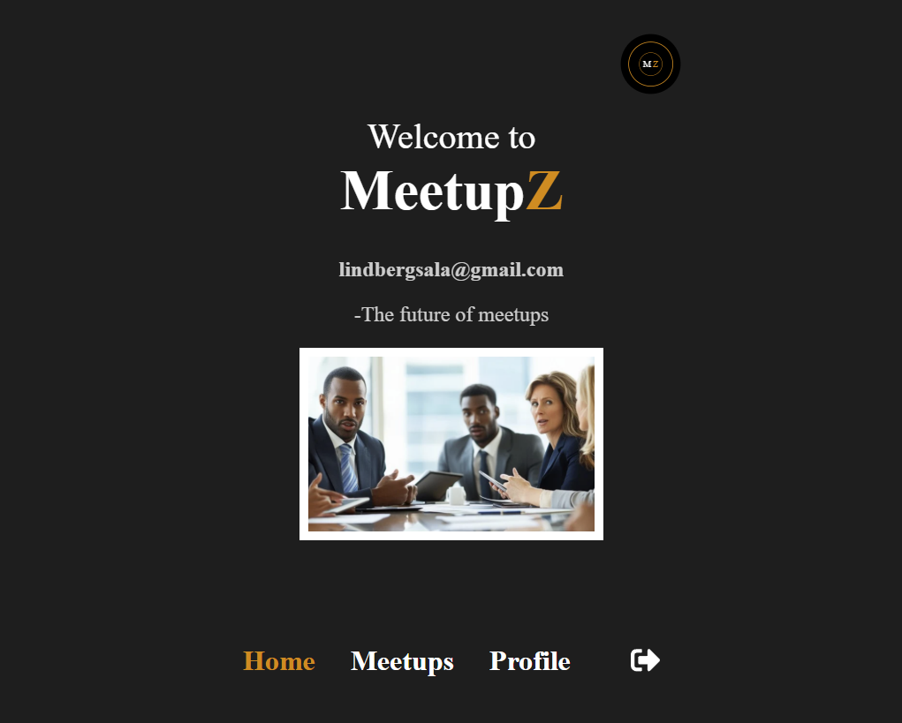
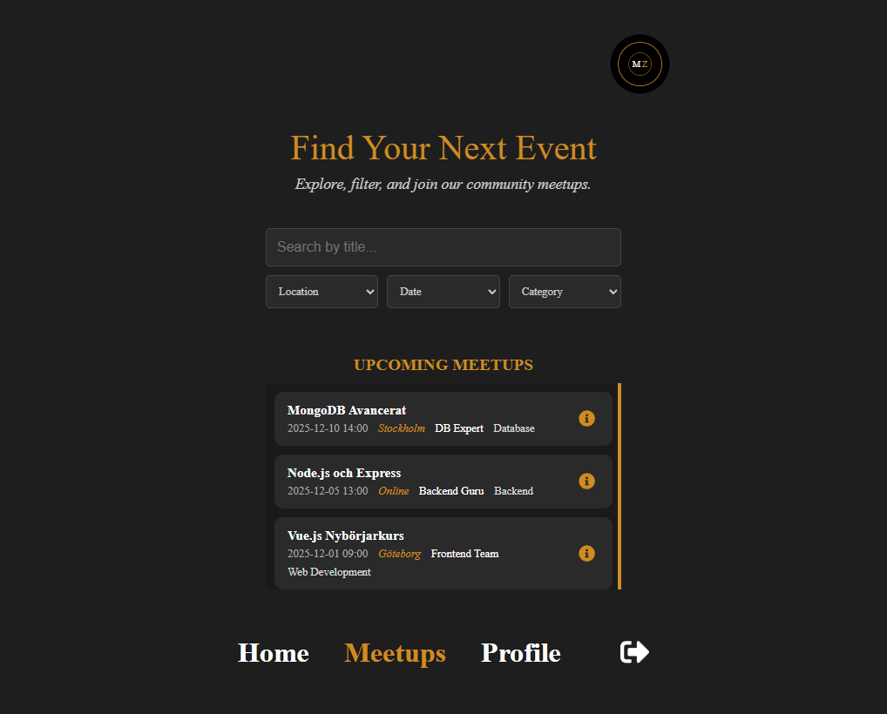
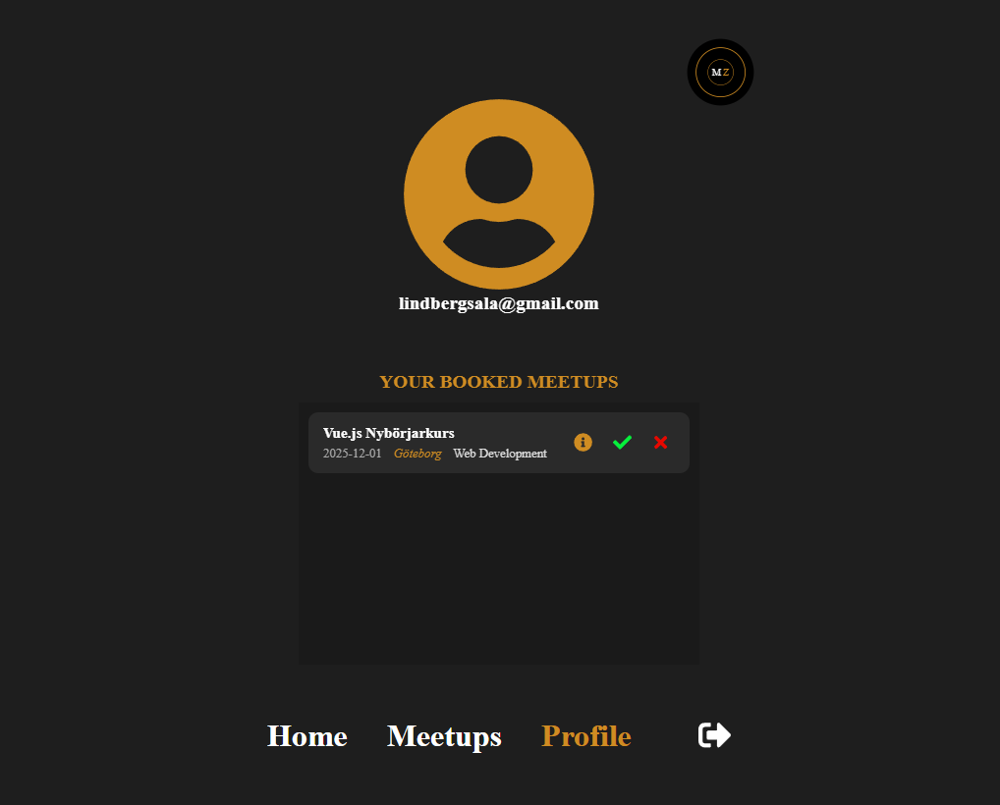

# Meetup App – Fullstack CI/CD Projekt

**Grupp­examinationen i CI/CD**.

Applikationen låter användare se och anmäla sig till meetups.  
Projektet är byggt med **React**, **Express.js**, **MongoDB**, **Docker** och **GitHub Actions**,  
och är fullt driftsatt med **CI/CD** via **AWS S3** (frontend) och **Render** (backend).

---

## 🚀 Tech Stack

**Frontend**

- React (Vite)
- Hostad på **AWS S3**
- CI/CD via **GitHub Actions**

**Backend**

- Node.js & Express.js API
- Hostad på **Render** via Docker-container
- Databas: **MongoDB Atlas (moln)**
- CI/CD via **GitHub Actions**

---

## 🧱 Arkitektur

```
Frontend (React) → Backend API (Express) → MongoDB Atlas
AWS S3             Render (Docker)
```

- Frontend och backend har separata GitHub Actions workflows.
- Backend körs som en Docker-container på Render.
- Vid merge till `main` deployas båda delarna automatiskt.

---

## 🧩 Git Flow

Projektet följer **git flow**:

- `main` → produktionsbranch (triggar deployment)
- `dev` → utvecklingsbranch
- `feature/*` → en gren per user story

## ⚙️ CI/CD Pipelines

### Frontend (AWS S3)

- Trigger: merge/push till `main`
- Steg:
  1. Installera dependencies
  2. Bygg projektet (`npm run build`)
  3. Deploya build-mappen till **AWS S3**

## 🧪 Installation (lokalt)

### Klona repo

```bash
git clone https://github.com/<org>/<repo>.git
cd <repo>
```

### Starta backend

```bash
cd backend
npm install
node server.mjs
```

### Starta frontend

```bash
cd frontend
npm install
npm run dev
```

Frontend körs normalt på `http://localhost:5173`  
Backend på `http://localhost:3000`

---

## 🌐 Deployment URLs

| Del          | Miljö           | URL                                                                                                                                             |
| ------------ | --------------- | ----------------------------------------------------------------------------------------------------------------------------------------------- |
| **Frontend** | AWS S3          | [https://meetups-containers-bucket.s3-website.eu-north-1.amazonaws.com/](http://meetups-containers-bucket.s3-website.eu-north-1.amazonaws.com/) |
| **Backend**  | Render (Docker) | [https://meetups-server-containers.onrender.com/](https://meetups-server-containers.onrender.com/)                                              |
| **Databas**  | MongoDB Atlas   | `meetups.ahlkeeb.mongodb.net`                                                                                                                   |

---

## 🖼️ Skärmavbilder

### Logga in


### Home



### Meetups



### Profil


